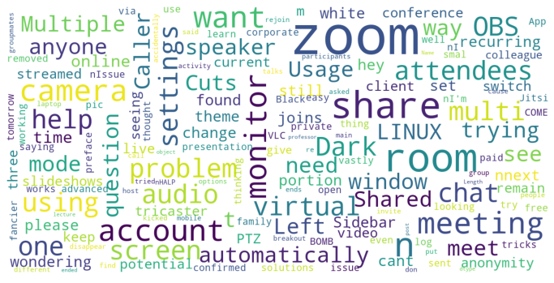
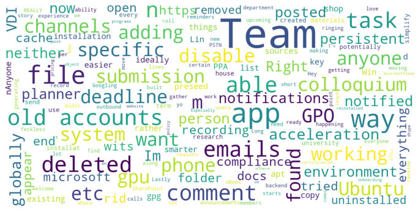
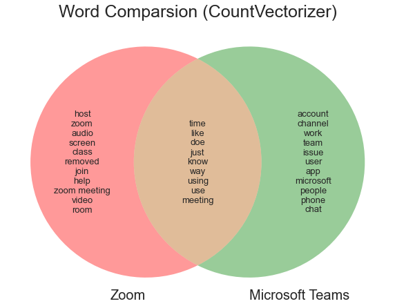
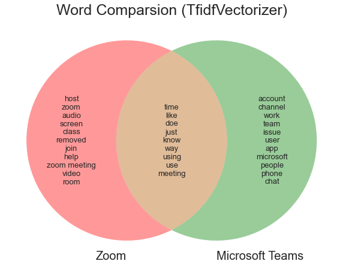
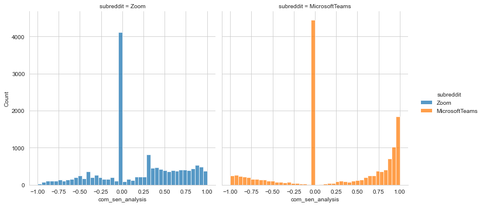
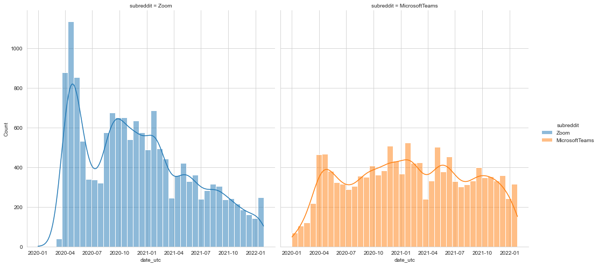
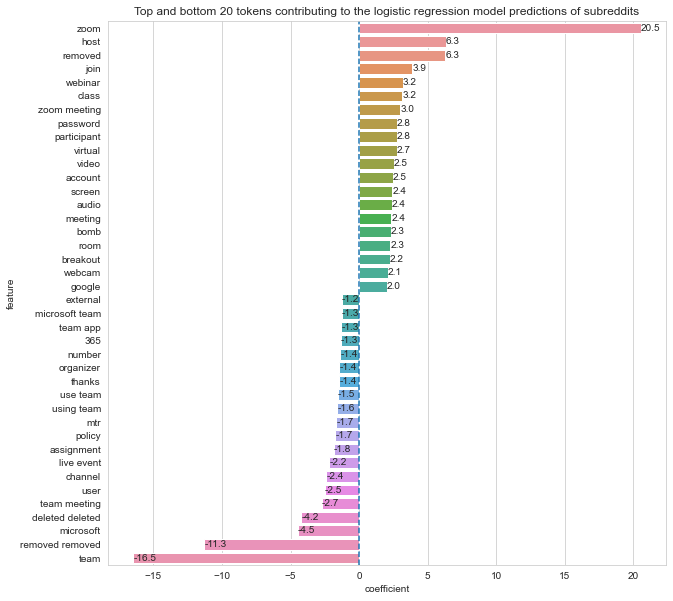

# Project 3: Web APIs and NLP

__Background__ 
For project 3, our goal is two-fold: 
1. Using Pushshift's API, you'll collect posts from two subreddits of your choosing.
2. Use NLP to train a classifier on which subreddit a given post came from. This is a binary classification problem.

# Microsoft Teams and Zoom

__Contents__ 
1. [Problem Statement](#problem-statement)
2. [Executive Summary](#executive-summary)
3. [Data Sources](#data-sources)
4. [Data Dictionary](#data-dictionary)
5. [Python Library Used](#python-library-used)
6. [Preprocessing](#preprocessing)
7. [EDA](#EDA)
8. [Modeling](#modeling)
9. [External Research](#external-research)
10. [Conclusions and Recommendations](#conclusions-and-recommendations)
11. [References](#References)
---

## Problem Statement

`Microsoft Teams` is one of `Zoom`'s largest and fastest growing competitor. We want to examine what users have been discussing on Reddit by applying NLP techniques.

__Subreddit links:__
- r/Zoom: https://www.reddit.com/r/Zoom/ (26.7k members, 14.7k submissions since 1 Jan 2020)
- r/Microsoft Teams: https://www.reddit.com/r/MicrosoftTeams/ (36.5k members, 12.6k submissions since 1 Jan 2020)

We will then train a classifier to accurately classify content between the two subreddits, `Zoom` or `Microsoft Teams`. Based on the models, we will make recommendations on two prongs - to the software development team and the marketing team:
1. Software Development Team - to highlight what are the common issues faced by users, as well as any additional features that users would like (if any)
2. Marketing - (i) to look at what features Microsoft Teams users have issues with (more than Zoom users) and tweak our campaigns to capitalise on their perceived weaknesses and (ii) to look at which words are closely associated with Zoom and Microsoft Teams. These words can be considered for our Search Engine Marketing and Search Engine Optimisation campaigns. To utilise these words as paid keywords such as Google AdWords or organic keywords in our sites.

### Report
This report is prepared to tackle the identified problem statement which is meant to build our skill in `Web APIs and NLP`.

The report is split into 3 notebooks:
1. Zoom_Subreddit_API: Data extraction of `Zoom` subreddit
2. Microsoft_Teams_Subreddit_API: Data extraction of `Microsoft Teams` subreddit
3. Analysis_of_the_subreddits: Sentiment Analysis and (Key) Problems faced by users using Zoom and/or Microsoft Teams and predicting which subreddit a submission belongs to.

---

## Executive summary

In year 2020, with governments across the world placing their citizens on lockdown and companies embracing a work-from-home culture due to Covid-19, there was a huge rise in video conferencing tools such as Zoom, Microsoft Teams and Cisco Webex. ([link](https://www.officereality.co.uk/blog/article-the-rise-of-video-conferencing)).

As a data scientist in Zoom, there was an increase in the usage of the product. One of the company's interest would be to increase or retain the market share. One way of getting consumer's feedback would be through the subreddit, https://www.reddit.com/r/Zoom/ which has 26.7k members and 14.7k submissions since 1 Jan 2020.

By comparing against another platform (in this problem, Microsoft Teams), we will compare the general sentiment of users using Sentiment Analysis and compare top common words associated with the two video conferencing tools.

A classifier is trained to accurately classify content between the two subreddits, `Zoom` or `Microsoft Teams`. Based on the models, we will make recommendations on two prongs - to the software development team and the marketing team:
1. Software Development Team - to highlight what are the common issues faced by users, as well as any additional features that users would like (if any)
2. Marketing - (i) to look at what features Microsoft Teams users have issues with (more than Zoom users) and tweak our campaigns to capitalise on their perceived weaknesses and (ii) to look at which words are closely associated with Zoom and Microsoft Teams. These words can be considered for our Search Engine Marketing and Search Engine Optimisation campaigns. To utilise these words as paid keywords such as Google AdWords or organic keywords in our sites.

---

## Data Sources
- Subreddit
  - [Zoom](https://www.reddit.com/r/Zoom/)
  - [Microsoft Teams](https://www.reddit.com/r/MicrosoftTeams/)
- [Pushshift API GitHub](https://github.com/pushshift/api)

---

## Python Library Used

Combining the python library used in both notebooks:

__For url reading__
1. requests

__For Calculations and Data Manipulations__
1. Numpy
2. Pandas

__For Graph Plottings__
1. Matplotlib
2. Seaborn
3. From matplotlib_venn
  1. venn2

__For NLP and Modelling__
1. From nltk
  1. stem
    1. WordNetLemmatizer
  2. corpus
    1. stopwords
  3. sentiment.vader
    1. SentimentIntensityAnalyzer
2. From sklearn
  1. feature_extraction.text
    1. CountVectorizer
    2. TfidfVectorizer
    3. TfidfTransformer
  2. model_selection
    1. train_test_split
    2. GridSearchCV
    3. cross_val_score
  3. pipeline
    1. Pipeline
  4. naive_bayes
    1. MultinomialNB
    2. BernoulliNB
  5. linear_model
    1. LogisticRegression
    2. LogisticRegressionCV
  6. metrics
    1. confusion_matrix
    2. plot_confusion_matrix
    3. classification_report
    4. accuracy_score
  7. ensemble
    1. RandomForestClassifier
    2. ExtraTreesClassifier
  8. neighbors
    1. KNeighborsClassifier
3. re
4. string

__For csv file exporting folder creation__
1. os

__For Word Cloud__
1. From wordcloud
  1. WordCloud
  2. STOPWORDS
__
---
## Preprocessing

1. Combined `title` and `selftext` into a single column
2. Removed stop words
3. Lemmatization

---

## EDA

We performed data analysis on the data from 1 Jan 2020 till 16 Jan 2022 and following conclusion was drawn.

1. We looked at the wordcloud (for fun) to see common occurance words.

Below 2 images are wordclouds for the submissions before any cleaning or lemmatizing took place.

__For Zoom:__ 
 

__For Microsoft Teams:__ 
 
 

2. We compared the two subreddit top twenty words and the below venn diagram was obtained.

 
 
Even though we employed different vectorizer (transformer), the top twenty words are the same.
 

3. Sentiment Analysis (using Vader) was performed and the compound score was plotted:

 

From above graph, we see that majority of the compound scores lies at  0 . This suggests the submissions at the subreddits are mostly of neutral stand.

We also could infer that a large number of submissions in MicrosoftTeams are of extreme positive sentiment (peak near  1 ), whereas the sentiment for submissions in Zoom are more balanced, with more submissions having a positive score as compared to negative.

__Compound score:__

| subreddit | count | mean | std | min | 25% | 50% | 75% | max |
|-|-|-|-|-|-|-|-|-|
| MicrosoftTeams | 12946.0 | 0.258201 | 0.600570 | -0.9988 | 0.0 | 0.0000 | 0.8796 | 0.9998 |
| Zoom | 15018.0 | 0.188739 | 0.465608 | -0.9977 | 0.0 | 0.0772 | 0.5719 | 0.9992 |

From the table, we can infer that

- MicrosoftTeams had a slightly higher maximum compound score (0.0006) and a lower minimum compound score than Zoom.
- Zoom had 50% or more data having positive compound score.
- Zoom has a smaller spread (smaller std) of compound score.
 

4. Submissions date was plotted to see the frequency of the posts over the period of the data collected. The most common year of data was 'obtained'  

 

From the graphs, we can see that submissions in Zoom subreddit spiked in Apr 2020 before fluctuating which submissions in Microsoft Teams remains relatively consistent after rising in Apr 2020.

As such, we will take the submissions from 01 Apr 2020 to 31 Mar 2021 for our modelling purpose below.

---

## Modeling

Pipeline model built with 1 estimator and 1 classifier model.
Estimator used:
1. CountVectorizer
2. TfidfVectorizer

Classifier Models created:
1. Logistic regression
2. Naive Bayes
3. Random Forest
4. K Nearest Neighbors

As our model's aim is to classify which subreddit a submission would likely come from, accuracy is a suitable metrics to access the model.

The top 3 results are as follows:
| Transformer | Estimator | Accuracy |
|-|-|-|
| CountVectorizer | Random Forest | 0.9816287878787879 |
| TfidfVectorizer | Random Forest | 0.94375 |
| TfidfVectorizer | Logistric Regression | 0.9428030303030303 |

However, the intepretation of random forest is not easy to understand. Although Random Forest models have higher accuracy score, they are harder to interpret. The Logistic Regression model is more interpretable, and with a close accuracy score, it should be okay for us to draw conclusion using the Logistic Regressor instead of the random forest models.

 

The coefficients of Logistic Regression measures the degree which the target variable (in this case `Zoom`/`1` or `Microsoft Teams`/`0`) is sensitive to the feature. A larger absolute value of the coefficients implies that the target is more sensitive towards that feature.

For feature with coefficient $x$, we can interpret that for every increase of 1 in the feature, it will lead to an increase of $exp(x)$-1 probability of getting target variable of `1`.

We can see that these identified variables have a large impact as the values are more than 1.  

From the above graph, we see that the words "zoom" has the largest positive coefficient and "team" has the largest negative coefficient. This comes as no surprise seeing that the words are (part of) the name of the video conferencing tool.

---

## External Research

__UNIX Epoch timestamp Convertor__ 
Link: https://www.epochconverter.com/

Explanation:  
To convert datetime to epoch value.

__Word Cloud in Python__ 
Link: https://stackoverflow.com/questions/16645799/how-to-create-a-word-cloud-from-a-corpus-in-python

Explanation:  
To create a word cloud based on dataframe column of strings.

__Function for word cleaning__ 
Link: https://github.com/scolnik/dsi-project-03-reddit/blob/master/project03_Sarah-Scolnik_clean-eda.ipynb

Explanation:  
Function used to clean text

__Graph Plotting__ 
Link: https://github.com/cheekeet86/project_3/blob/master/code/project_3.ipynb

Explanation:  
Code used to plot Graph of words after `CountVectorizer` and `TfidfVectorizer`.

__Feature Importance for RandomForestClassifier__ 
Link: https://towardsdatascience.com/explaining-feature-importance-by-example-of-a-random-forest-d9166011959e

Explanation: 
A means to explain random forest models.

---

## Conclusions and Recommendations
### EDA
During EDA, we looked at the wordclouds, top 20 words for `Zoom` and `Microsoft Teams`, Sentiment Analysis and Time Period of the submissions.

We made the following conclusion for Sentiment Analysis on the submissions:

__Compound score:__

| subreddit | count | mean | std | min | 25% | 50% | 75% | max |
|-|-|-|-|-|-|-|-|-|
| MicrosoftTeams | 12946.0 | 0.258201 | 0.600570 | -0.9988 | 0.0 | 0.0000 | 0.8796 | 0.9998 |
| Zoom | 15018.0 | 0.188739 | 0.465608 | -0.9977 | 0.0 | 0.0772 | 0.5719 | 0.9992 |

We can see that although the score for `Microsoft Teams` is higher than `Zoom`, more users seems to be feeling positive about `Zoom` as compared to `Microsoft Teams` as there is more than 50% of the data having positive compound score.

### Conclusion of model
Estimator used:
1. CountVectorizer
2. TfidfVectorizer

Classifier Models created:
1. Logistic regression
2. Naive Bayes
3. Random Forest
4. K Nearest Neighbors

Using Pipeline and GridSearchCV, we ran the models and the top 3 results are as follows:

| Transformer | Estimator | Accuracy |
|-|-|-|
| CountVectorizer | Random Forest | 0.9816287878787879 |
| TfidfVectorizer | Random Forest | 0.94375 |
| TfidfVectorizer | Logistric Regression | 0.9428030303030303 |

However, the intepretation of random forest is not easy to understand. Although Random Forest models have higher accuracy score, they are harder to interpret. The Logistic Regression model is more interpretable, and with a close accuracy score, we drew conclusion using the logistic regression model.

### Recommendations

1. Software Development Team:

Issues faced for Zoom:
- Interface on Linux
- Zoom for class / Webinar
- Internet Connection issue
- Microphone and Video Options to default as off
- Audio quality

2. Marketing:

Issues faced for Microsoft Teams:
- Interface on Linux
- Sign-in issues
- Audio issues
- Chat features (not applicable in `Zoom`)

It seems like the issues faced by the `Zoom` and `Microsoft Teams` are similar, so if the software development team is able to resolve the issues first, then we can use that as selling points of `Zoom` as the preferred video conferencing tool.

Top 10 Words that tends to be associated towards `Microsoft Teams`:
- team
- removed
- microsoft
- team meeting
- user
- channel
- live event
- assignment
- policy
- 365

We can consider adding these words for our Search Engine Marketing and Search Engine Optimisation campaigns and to utilise these words as paid keywords such as Google AdWords or organic keywords in our sites.

#### Ways to improve
- Add more words to stop words such as 'thanks', 'removed' as model stop words as this affects sentiment analysis but not for model prediction.
- To include other subreddit of other video conferencing tools like Webex ([link](https://www.reddit.com/r/webex/)).
- Filter out posts that are of 'spamming' nature. E.g. Row 2373 post has no relation to `Zoom`.

---

## References
1. Rise of Video Conferencing - https://www.officereality.co.uk/blog/article-the-rise-of-video-conferencing
2. Epoch Convertor - https://www.epochconverter.com/
3. Word Cloud - https://stackoverflow.com/questions/16645799/how-to-create-a-word-cloud-from-a-corpus-in-python
4. Vader - https://www.geeksforgeeks.org/python-sentiment-analysis-using-vader/
5. Cleaner function - https://github.com/scolnik/dsi-project-03-reddit/blob/master/project03_Sarah-Scolnik_clean-eda.ipynb
6. Graph plotting - https://github.com/cheekeet86/project_3/blob/master/code/project_3.ipynb
7. Feature Importance - https://towardsdatascience.com/explaining-feature-importance-by-example-of-a-random-forest-d9166011959e
---
